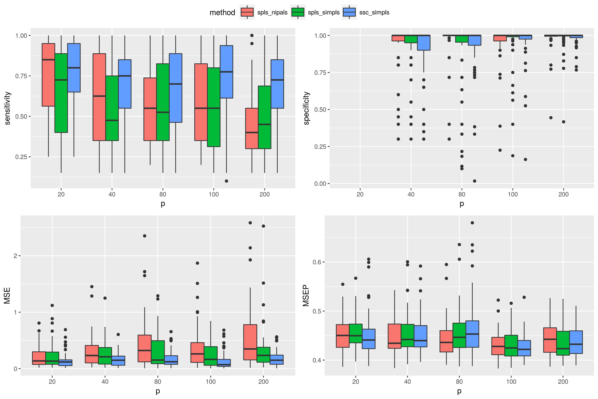

Sparse Subspace Constrained Partial Least Squares
=================================================

`sscpls` is an R package that provides an implementation of an ADMM algorithm for sparse subspace constrained PLS.

### Install instructions

Use devtools to install:

``` r
#library(devtools)
#install_github("sscpls", "matt-sutton")
```

#### Example 1 (Orthogonal components)

The PLS direction vectors are sparse using \(\ell_1\) penalty term and must lie in a subspace which ensurse orthogonality of components. See below for an example.

``` r
set.seed(0)
library(sscpls)
n<-50 # number of observations
p<-50 # number of variables
X<-matrix(rnorm(n*p),ncol=p)
X <- scale(X)
beta <- c(1:5, rep(0, p-5))
y<-X%*%beta + matrix(rnorm(n))

fitcv <- cv_sscpls(X, y, K = 1:4, lambda = 1:9/10, fold = 10)
fit <- sscpls(X, y, ncomp = fitcv$K, lambda = fitcv$lambda.1se, scale = F)

Beta_comps <- matrix(unlist(fit$Beta), ncol = 4) # Get Matrix of beta estimates at each component
show_nonzero(cbind(Beta_comps, beta))
```

    ##                                            beta
    ## [1,] 0.000000 0.0000000 0.000000 0.8911406    1
    ## [2,] 0.000000 0.8044167 2.452667 2.3085410    2
    ## [3,] 0.000000 3.6224475 3.284905 3.0467054    3
    ## [4,] 3.659768 4.2600073 4.175163 4.1479382    4
    ## [5,] 4.936481 4.9364808 4.936481 4.9364808    5

The objective and orthogonality constraints:

``` r
M <- crossprod(X, y)
# objective maximised
diag(crossprod(t(M)%*%fit$V)) 
```

    ## [1] 88652.260 35412.917  6856.863  1401.428

``` r
# constraint satisfied
round(crossprod(fit$x.scores),digits = 4)  
```

    ##      [,1] [,2] [,3] [,4]
    ## [1,]    1    0    0    0
    ## [2,]    0    1    0    0
    ## [3,]    0    0    1    0
    ## [4,]    0    0    0    1

### Replication of simulation study

Replication of the simulation study of the subspace constrained PLS paper. The simulation uses the package simrel for generating data from a sparse subspace.

See the subfolder replication.

<!-- -->
